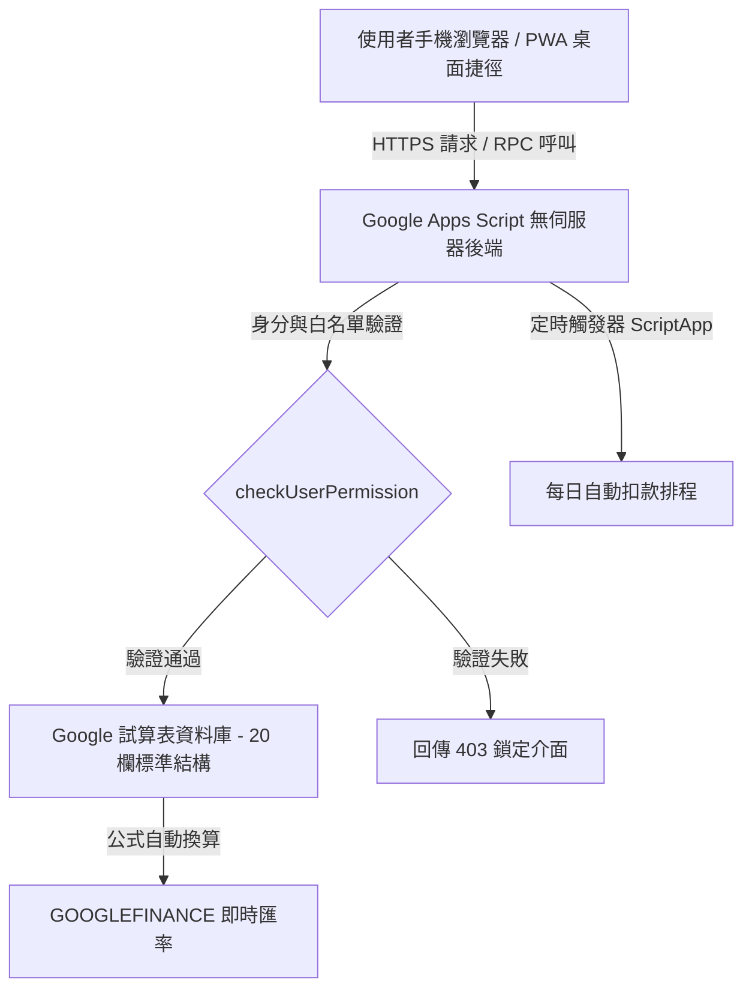

# 導讀：10 分鐘極速上線指南

歡迎閱讀《Google Apps Script 共同記帳系統實戰——$0 成本打造私有多人分帳架構》。

本專案專為情侶、室友、旅行團體與小型團隊設計，徹底擺脫市售記帳 App 廣告氾濫、月租訂閱與資料隱私外洩的困擾。透過 Google 試算表（Google Sheets）作為關聯式資料庫，搭配 Google Apps Script（GAS）提供無伺服器（Serverless）後端運算，結合 HTML5/CSS3 現代響應式前端，實現 **$0 運行成本、永久維護、資料 100% 私有** 的完整解決方案。

---

## 1. 系統架構全景



---

## 2. 部署流程標準作業程序 (SOP)

### Step 1：範本一鍵複製（Copy URL 機制）
Google 試算表提供原生副本複製機制。使用者僅需透過包含 `/copy` 的網址，即可在個人的 Google 雲端硬碟中完整建立包含程式碼與設定的獨立副本：

```text
https://docs.google.com/spreadsheets/d/{SPREADSHEET_ID}/copy
```

點擊「建立副本」後，試算表會完整繼承：
- 5 張標準工作表（`支出記錄`、`週期設定`、`設定`、`分類設定`、`付款帳戶`）。
- 內建的 Google Apps Script 原始碼專案（包含 `Code.gs` 與 `index.html`）。

---

### Step 2：首次執行系統初始化
1. 開啟複製後的 Google 試算表。
2. 點選試算表頂部自訂選單：`📊 記帳系統` → `1️⃣ 第一步：初始化系統 (必點)`。
3. **安全性授權認證**：
   - 首次執行自訂腳本時，Google 會跳出「需要授權」警示視窗。
   - 點擊 **進階 (Advanced)**。
   - 點擊 **前往「共同記帳系統」（不安全）**（因屬於個人開發的私有腳本，非公開 Marketplace 套件）。
   - 點擊 **允許 (Allow)**。
4. 授權完成後，系統會自動呼叫 `initializeSpreadsheet()`：
   - 自動將當前使用者的 Google 帳號寫入 `設定` 工作表的白名單中。
   - 初始化標準工作表樣式、欄寬、凍結列與範例資料。
   - 註冊每日早上 9 點自動檢查週期扣款的時間觸發器。

---

### Step 3：部署 Web 應用程式 (Web App)
1. 於試算表上方工具列點選 `擴充功能` → `Apps Script`。
2. 進入 Apps Script 編輯器後，點擊右上角藍色按鈕 `部署` → `新部署`。
3. 點選左側齒輪圖示，選擇 `網頁應用程式`。
4. 配置部署參數（**關鍵安全性與權限設定**）：
   - **說明**：`共同記帳正式版 v2.56`
   - **執行身分 (Execute as)**：`我 (Me - 您的 Google 帳號)` —— *確保 Web App 擁有讀寫後端試算表的最高權限*。
   - **具有存取權限的人 (Who has access)**：`所有人 (Anyone)` —— *讓未登入或共同記帳成員能透過前端直接存取，身分識別由系統內部白名單控管*。
5. 點擊 `部署`，複製產出的 `網頁應用程式網址 (Web App URL)`。

---

## 3. 白名單授權機制與快速設定產生器原理

本系統採用應用層存取控制（Application-Level ACL），而非單純依賴 Google 試算表的共用權限。

### 白名單檢驗原理 (`checkUserPermission`)
在 `Code.gs` 中，每次前端發起請求時，後端皆會透過 `Session.getActiveUser().getEmail()` 取得當前存取者的 Google 帳號，並比對 `設定` 工作表中的 `B6` 儲存格：

```javascript
/**
 * 檢查使用者是否有權限存取系統
 * 驗證存取者是否在試算表設定的白名單內
 */
function checkUserPermission() {
  const user = Session.getActiveUser().getEmail();
  const ss = SpreadsheetApp.getActiveSpreadsheet();
  const settingsSheet = ss.getSheetByName(CONFIG.SHEET_NAMES.SETTINGS);

  if (!settingsSheet) {
    return { allowed: false, user: user, name: user.split("@")[0] };
  }

  // 讀取允許的使用者清單（設定工作表 B6）
  const allowedUsers = settingsSheet.getRange("B6").getValue();

  if (!allowedUsers) {
    // 若未設定白名單，預設僅允許試算表擁有者
    const owner = ss.getOwner().getEmail();
    return {
      allowed: user === owner,
      user: user,
      name: user.split("@")[0]
    };
  }

  // 以逗號分割並標準化為小寫清單
  const userList = allowedUsers.toString().split(",").map(function(u) {
    return u.trim().toLowerCase();
  });

  return {
    allowed: userList.includes(user.toLowerCase()),
    user: user,
    name: user.split("@")[0]
  };
}
```

### 多人協作與邀請成員
1. **直接修改試算表**：管理員可直接在 `設定` 工作表的 `B6` 儲存格填入逗號分隔的 Email 清單（例如：`alice@gmail.com, bob@gmail.com`）。
2. **透過 Web App 介面邀請**：管理員在手機端點擊「邀請成員」，輸入對方 Email 後，系統呼叫 `inviteMember(email)`，將該 Email 自動追加至 `B6`，並由 Google 伺服器發送專屬加入通知信。
