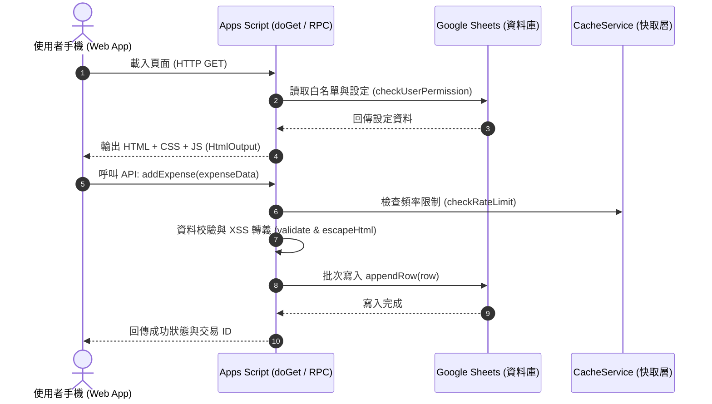

# 第 1 章：共同記帳痛點與 $0 架構設計

## 1. 商業記帳 App 的根本缺陷

在個人或團隊財務管理中，市面上常見的記帳軟體（如 Splitwise、Settle Up 等）在商業化後普遍存在以下問題：

1. **高昂的訂閱成本與功能閹割**：免費用戶常被限制每日僅能記錄 3~4 筆交易，或限制圖片上傳與搜尋功能，強迫使用者按月支付訂閱費。
2. **廣告干擾與操作繁瑣**：介面充斥各類彈出式廣告與推薦版面，大幅降低現場極速記帳的效率。
3. **資料隱私與平台鎖定 (Vendor Lock-in)**：敏感的財務與消費流水帳被存放在第三方伺服器，使用者難以掌控資料所有權，欲匯出完整歷史明細往往需要付費解鎖。
4. **客製化彈性低**：無法依據情侶或特定小組的特殊分帳規則（如薪資比例分攤、特定幣別手續費、專案分帳）自訂計算邏輯。

---

## 2. Google Sheets 作為關聯式資料庫：20 欄標準架構

本系統將 Google 試算表（Google Sheets）視為強型別的單表關聯式資料庫，定義了完整的 20 欄標準結構：

| 欄位序號 | 欄位名稱 | 內部型別 | 說明與商業邏輯 |
| :---: | :--- | :--- | :--- |
| 1 | `日期` | Date (YYYY-MM-DD) | 交易發生的年月日 |
| 2 | `項目` | String | 支出或收入描述（經過 XSS 消毒過濾） |
| 3 | `金額(TWD)` | Number (Float) | 換算為新台幣後的基準金額 |
| 4 | `原始金額` | Number (Float) | 外幣交易時的原始計價金額（例如 10,000 日圓） |
| 5 | `幣別` | String (ISO 4217) | 交易貨幣代碼（如 TWD, JPY, USD, EUR） |
| 6 | `匯率` | Number (Float) | 當筆交易所採用的換算匯率（對 TWD） |
| 7 | `付款人` | String (Enum) | 邏輯付款人：`你` / `對方` / `兩人` |
| 8 | `實際付款人` | String | 支援代墊情境的實體出資者 |
| 9 | `你的部分` | Number (Float) | 己方應分攤的責任金額 |
| 10 | `對方的部分` | Number (Float) | 對方應分攤的責任金額 |
| 11 | `你實付` | Number (Float) | 己方在現場實際掏出的現金或刷卡金額 |
| 12 | `對方實付` | Number (Float) | 對方在現場實際掏出的金額 |
| 13 | `分類` | String | 主分類或多階層分類（例如：`飲食`、`飲食>早餐`） |
| 14 | `付款帳戶` | String | 現金、信用卡、LINE Pay、悠遊卡等資產帳戶 |
| 15 | `專案` | String | 跨國旅遊或特殊事件標籤（如 `2026東京自由行`） |
| 16 | `是否週期` | Boolean | 標記是否由排程自動扣款產生的記錄 |
| 17 | `週期日期` | Integer | 每月自動扣款日 (1~31) |
| 18 | `ID` | String / Long | 唯一交易識別碼（Timestamp + Random 隨機字串） |
| 19 | `記錄類型` | String (Enum) | `expense`(共同支出) / `personal`(個人) / `income`(收入) / `settlement`(結算) |
| 20 | `記錄擁有者` | String (Email) | 該筆紀錄建立者的 Google Email |

---

## 3. GAS 無伺服器後端運作機制



### `doGet()` 渲染與安全性防護
Google Apps Script 的 `doGet()` 是 Web App 的入口函式。系統透過以下機制確保安全性與跨平台相容性：

```javascript
function doGet() {
  // 1. 應用層白名單驗證
  const permission = checkUserPermission();

  if (!permission.allowed) {
    // 權限不足時直接輸出 403 鎖定介面
    return HtmlService.createHtmlOutput(`
      <div style="text-align:center;padding:40px;font-family:sans-serif;">
        <h1 style="color:#ef4444;">🔒 無法存取</h1>
        <p>您的帳號 (${permission.user}) 尚未獲得管理員授權。</p>
      </div>
    `).setTitle("無法存取");
  }

  // 2. 載入主介面並設定 X-Frame-Options 防點擊劫持
  const htmlOutput = HtmlService.createHtmlOutputFromFile("index")
    .setTitle("共同記帳")
    .setXFrameOptionsMode(HtmlService.XFrameOptionsMode.DEFAULT);

  // 3. 強制設定 viewport 防止行動端輸入縮放
  htmlOutput.addMetaTag("viewport", "width=device-width, initial-scale=1.0, maximum-scale=1.0, user-scalable=no");

  return htmlOutput;
}
```

---

## 4. 配額上限與效能最佳化實務

Google Apps Script 免費版提供了極為充裕但具備邊界的配額：

| 配額維度 | 免費版上限 | 系統最佳化設計 |
| :--- | :--- | :--- |
| **單次執行逾時** | 6 分鐘 | 資料批次運算，避免長時間鎖定 |
| **每日觸發器執行時間** | 90 分鐘 / 天 | 週期扣款每日僅執行 1 次，耗時約 2 秒 |
| **URL Fetch 呼叫次數** | 20,000 次 / 天 | 匯率快取於試算表，避免頻繁發起外網請求 |
| **電子郵件發送量** | 100 封 / 天 | 成員邀請與通知僅在必要時發送 |

### 試算表 I/O 批次處理原則 (Batch I/O)
在 GAS 開發中，呼叫試算表 API 是最主要的效能瓶頸。
- **嚴禁寫法**：在 `for` 迴圈中逐行呼叫 `sheet.getRange(row, col).setValue()`（會造成大量 HTTP RPC 開銷）。
- **標準寫法**：使用 `sheet.getDataRange().getValues()` 一次性將資料讀入 JavaScript 陣列，運算完畢後透過 `sheet.getRange(...).setValues()` 或 `appendRow()` 一次提交寫入。

### 快取機制與頻率防護 (`checkRateLimit`)
為防止網路重送或惡意連點，系統使用 `CacheService.getUserCache()` 建立滑動視窗頻率限制器：

```javascript
function checkRateLimit(action) {
  const userCache = CacheService.getUserCache();
  const key = "ratelimit_" + action;
  const count = userCache.get(key);

  if (count && Number(count) > 50) { // 每分鐘最多允許 50 次操作
    throw new Error("操作過於頻繁，請稍候再試。");
  }

  userCache.put(key, Number(count || 0) + 1, 60); // 60 秒有效期限
}
```
