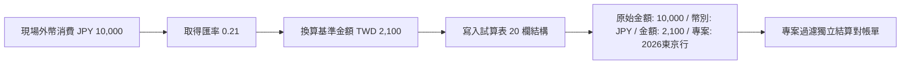

# 第 4 章：多幣別即時換算與出國帳本

## 1. `GOOGLEFINANCE` 動態匯率整合架構

跨國旅遊、出國代購與外幣海淘已成為現代共同生活的高頻情境。本系統在 `設定` 工作表中內建了即時外匯自動更新引擎，利用 Google 試算表原生的 `GOOGLEFINANCE` 函式進行自動報價換算：

```javascript
// 在設定工作表中初始化 9 組主流外幣換算對
const currencyPairs = [
  ['JPY', '日幣', 'CURRENCY:JPYTWD'],
  ['USD', '美金', 'CURRENCY:USDTWD'],
  ['EUR', '歐元', 'CURRENCY:EURTWD'],
  ['HKD', '港幣', 'CURRENCY:HKDTWD'],
  ['CNY', '人民幣', 'CURRENCY:CNYTWD'],
  ['KRW', '韓元', 'CURRENCY:KRWTWD'],
  ['SGD', '新加坡幣', 'CURRENCY:SGDTWD'],
  ['GBP', '英鎊', 'CURRENCY:GBPTWD'],
  ['AUD', '澳幣', 'CURRENCY:AUDTWD'],
  ['THB', '泰銖', 'CURRENCY:THBTWD']
];

for (let i = 0; i < currencyPairs.length; i++) {
  const row = 22 + i;
  sheet.getRange(row, 1).setValue(currencyPairs[i][0]); // 幣別代碼
  sheet.getRange(row, 2).setValue(currencyPairs[i][1]); // 幣別名稱
  // 注入公式：若 API 連線異常則安全回傳 N/A
  sheet.getRange(row, 3).setFormula(`=IFERROR(GOOGLEFINANCE("${currencyPairs[i][2]}"), "N/A")`);
  // 記錄最後更新時間
  sheet.getRange(row, 4).setFormula(`=IF(ISNUMBER(C${row}), TEXT(NOW(), "yyyy/MM/dd HH:mm"), "")`);
}
```

---

## 2. 固定匯率離線備援機制 (`getExchangeRate`)

當使用者在國外機場漫遊、網路離線或遇到 Google 財經 API 配額限流時，後端內建的靜態備援字典會自動接管，確保交易換算不中斷：

```javascript
/**
 * 取得指定外幣的換算匯率（對 TWD）
 * 優先從試算表讀取動態匯率，失敗時自動啟用預設備援匯率
 */
function getExchangeRate(currency) {
  try {
    const ss = SpreadsheetApp.getActiveSpreadsheet();
    const settingsSheet = ss.getSheetByName(CONFIG.SHEET_NAMES.SETTINGS);

    if (settingsSheet) {
      // 讀取設定表中的匯率矩陣（第 22 列開始）
      const rateData = settingsSheet.getRange(22, 1, 10, 3).getValues();

      for (let i = 0; i < rateData.length; i++) {
        const currencyCode = String(rateData[i][0]).trim();
        const rate = parseFloat(rateData[i][2]);

        if (currencyCode === currency && rate > 0) {
          return rate;
        }
      }
    }
  } catch (e) {
    Logger.log("從設定表讀取匯率失敗: " + e.toString());
  }

  // 靜態備援字典 (Fallback Rates)
  const defaultRates = {
    'JPY': 0.21,    // 日幣
    'USD': 31.5,    // 美金
    'EUR': 34.5,    // 歐元
    'HKD': 4.05,    // 港幣
    'CNY': 4.35,    // 人民幣
    'KRW': 0.024,   // 韓元
    'SGD': 23.5,    // 新加坡幣
    'GBP': 40.0,    // 英鎊
    'AUD': 20.5,    // 澳幣
    'THB': 0.92     // 泰銖
  };

  if (defaultRates[currency]) {
    return defaultRates[currency];
  }

  Logger.log(`警告：找不到 ${currency} 的匯率，使用預設值 1.0`);
  return 1.0;
}
```

---

## 3. 出國專案帳本（`project` 欄位）與跨幣別結算

在多人旅遊或專案代購情境下，系統透過第 15 欄 `專案` 進行獨立標記（如 `2026-Tokyo-Trip`、`日本跨年行`）：



### 雙軌資料儲存優勢
1. **核對帳單手續費**：事後比對信用卡海外刷卡明細時，可直接比對 `原始金額` 與銀行實際入帳的台幣扣款額，精準分析海外交易手續費與即時匯差。
2. **單一專案獨立結算**：旅行結束後，管理者可直接在儀表板篩選特定專案名稱，一鍵計算該趟旅程全體花費與雙方淨餘額，而不與日常生活各類流水帳混淆。
