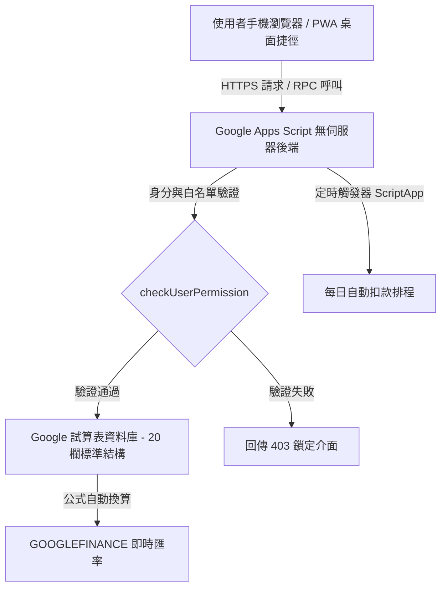

# 附錄 A：系統架構與設計原理（專業進階篇）

---
[← 返回正文：04 舊帳遷移、備份與日常維護](./04_舊帳遷移、備份與日常維護.md) ｜ [下一篇：06 附錄B 分帳核心演算法與原始碼解析 →](./06_附錄B：分帳核心演算法與原始碼解析.md)
---

> **本篇說明**：本附錄專為對系統底層架構、軟體工程設計或有客製化二次開發需求的專業讀者編寫。若您僅需日常使用，可略過此部分。

---

## 1. 系統架構全景

本系統基於 **Google Workspace 生態系** 構建，實現完全無伺服器（Serverless）與零主機維運成本（$0 Cost）的現代化 Web 應用程式架構：



### 架構核心特點
1. **無伺服器運算 (Serverless)**：由 Google Apps Script (GAS) 處理後端業務邏輯與 API 請求，具備高可用性，免去自行租用 VPS 與維護 Linux 伺服器的負擔。
2. **試算表即資料庫 (Sheets as Database)**：將 Google Sheets 作為強型別的資料儲存引擎，兼具資料視覺化、公式計算與歷程版本管理優勢。
3. **無依賴輕量前端**：前端採用原生 HTML5、CSS3 與 JavaScript 開發，不依賴龐大的第三方框架，保證在行動裝置上的秒開速度。

---

## 2. 試算表關聯式資料庫：20 欄標準架構

為了確保資料的一致性與未來擴展性，底層《支出記錄》工作表定義了 20 欄標準欄位模型：

| 欄位序號 | 欄位名稱 | 內部資料型別 | 業務邏輯與欄位說明 |
| :---: | :--- | :--- | :--- |
| 1 | `日期` | Date (YYYY-MM-DD) | 交易發生的年月日 |
| 2 | `項目` | String | 支出或收入描述（經 XSS 消毒處理） |
| 3 | `金額(TWD)` | Number (Float) | 換算為新台幣後的基準金額 |
| 4 | `原始金額` | Number (Float) | 外幣交易時的原始計價金額（例如 10,000 日圓） |
| 5 | `幣別` | String (ISO 4217) | 貨幣代碼（如 TWD, JPY, USD, EUR 等） |
| 6 | `匯率` | Number (Float) | 當筆交易採用的換算匯率（對 TWD） |
| 7 | `付款人` | String (Enum) | 邏輯付款人：`你` / `對方` / `兩人` |
| 8 | `實際付款人` | String | 支援代墊情境的實體出資者名稱 |
| 9 | `你的部分` | Number (Float) | 己方應分攤的責任金額 |
| 10 | `對方的部分` | Number (Float) | 對方應分攤的責任金額 |
| 11 | `你實付` | Number (Float) | 己方現場實際掏出的現金或刷卡金額 |
| 12 | `對方實付` | Number (Float) | 對方現場實際掏出的現金或刷卡金額 |
| 13 | `分類` | String | 主分類或多階層分類（例如：`飲食`、`交通`） |
| 14 | `付款帳戶` | String | 現金、信用卡、LINE Pay、悠遊卡等資產帳戶 |
| 15 | `專案` | String | 跨國旅遊或特定活動標籤（如 `2026東京自由行`） |
| 16 | `是否週期` | Boolean | 標記是否由定時排程自動扣款產生 |
| 17 | `週期日期` | Integer | 每月自動扣款日 (1~31) |
| 18 | `ID` | String / Long | 唯一交易識別碼（Timestamp + Random 亂數） |
| 19 | `記錄類型` | String (Enum) | `expense`(支出) / `settlement`(結算) / `income`(收入) |
| 20 | `記錄擁有者` | String (Email) | 該筆紀錄建立者的 Google 帳號 |

---

## 3. 應用層安全性與白名單控制 (Application-Level ACL)

系統不單純依賴試算表的權限共用，而是在 Apps Script 後端實施嚴格的應用層權限檢查：

```javascript
/**
 * 檢查使用者是否有權限存取系統
 * 驗證存取者是否在試算表設定的白名單內
 */
function checkUserPermission() {
  const user = Session.getActiveUser().getEmail();
  const ss = SpreadsheetApp.getActiveSpreadsheet();
  const settingsSheet = ss.getSheetByName(CONFIG.SHEET_NAMES.SETTINGS);

  if (!settingsSheet) {
    return { allowed: false, user: user, name: user.split("@")[0] };
  }

  // 讀取允許的使用者清單（設定工作表 B6）
  const allowedUsers = settingsSheet.getRange("B6").getValue();

  if (!allowedUsers) {
    const owner = ss.getOwner().getEmail();
    return {
      allowed: user === owner,
      user: user,
      name: user.split("@")[0]
    };
  }

  // 標準化白名單字串比對
  const userList = allowedUsers.toString().split(",").map(function(u) {
    return u.trim().toLowerCase();
  });

  return {
    allowed: userList.includes(user.toLowerCase()),
    user: user,
    name: user.split("@")[0]
  };
}
```

### 前端 XSS 防護
所有使用者輸入的品項名稱均經過特殊字元編碼，杜絕跨站腳本攻擊：
```javascript
function escapeHtml(text) {
  if (!text) return "";
  return String(text)
    .replace(/&/g, "&amp;")
    .replace(/</g, "&lt;")
    .replace(/>/g, "&gt;")
    .replace(/"/g, "&quot;")
    .replace(/'/g, "&#039;");
}
```

---

[← 返回正文：04 舊帳遷移、備份與日常維護](./04_舊帳遷移、備份與日常維護.md) ｜ [下一篇：06 附錄B 分帳核心演算法與原始碼解析 →](./06_附錄B：分帳核心演算法與原始碼解析.md)
