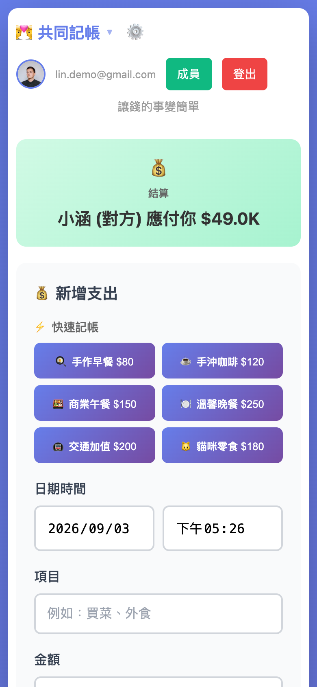
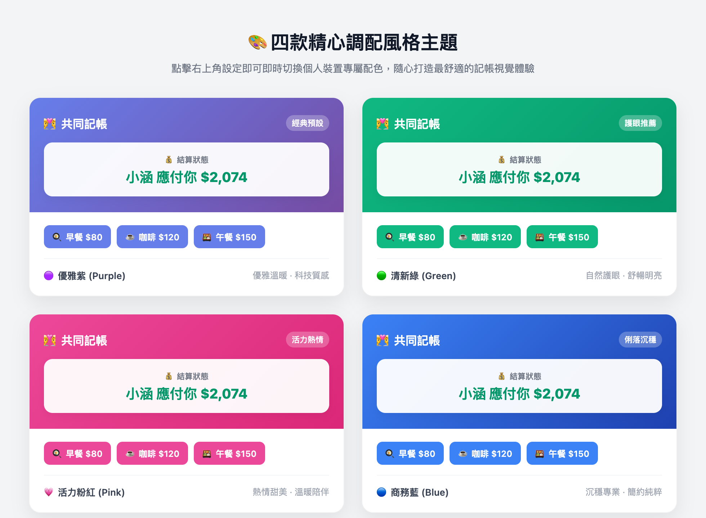

# 第 2 章：日常記帳與生活分帳情境

---
[← 上一章：01 導讀與快速開通](./01_導讀與快速開通.md) ｜ [下一章：03 出國旅遊與外幣帳本 →](./03_出國旅遊與外幣帳本.md)
---

共同記帳要能長久維持，「結帳當下 3 秒內完成記錄」是最關鍵的要素。如果每次結帳都需要打開 App Store 下載更新、等待廣告播放，或是點選繁瑣的多層選單，往往會讓人失去記帳的動力。

本章將帶領您將記帳網頁釘選至手機主畫面，並掌握日常生活中最常見的分帳情境。

---

## 1. 將記帳網頁加到手機主畫面（免下載 App）

透過手機瀏覽器的原生功能，可以將專屬記帳網頁轉化為如同原生 App 般的獨立圖示：

### iPhone (iOS Safari)
1. 使用 Safari 瀏覽器開啟您的專屬記帳網址。
2. 點擊螢幕下方的 **「分享」圖示**（一個向上箭頭的方形圖示）。
3. 往下滑動，選擇 **「加入主畫面」**。
4. 設定名稱（例如：`共同記帳`），點擊右上角的「新增」。
5. 之後直接從手機桌面點擊圖示，就會以全螢幕開啟，完全沒有網址列的干擾！

### Android (Chrome)
1. 使用 Chrome 瀏覽器開啟專屬記帳網址。
2. 點擊右上角的 **「選單（三個點）」**。
3. 選擇 **「新增至主畫面」** 或 **「安裝應用程式」**。
4. 桌面將會自動產生專屬圖示，點開即可迅速記帳。

---

## 2. 生活中常見的三大分帳情境

每筆消費的性質不盡相同，系統貼心設計了三種最常用的分攤方式：

### 情境一：平分模式（一人一半）
* **適用場合**：情侶共進晚餐、購買共享的日用品、超市買菜。
* **操作方式**：
  1. 輸入總金額（例如：晚餐 `$600`）。
  2. 選擇付款人（例如：`你` 現場付現）。
  3. 點選 **「平分」**。系統自動計算雙方各負擔 `$300`，並即時累計對方欠你 `$300`。

### 情境二：自訂比例分帳（如 6:4 或 7:3）
* **適用場合**：依據雙方薪資比例分攤每月房租、水電雜費。
* **操作方式**：
  1. 輸入總金額（例如：房租 `$20,000`）。
  2. 選擇比例分帳按鈕（或自訂輸入你的責任額 `$12,000`、對方 `$8,000`）。
  3. 送出後，系統會精準按責任額進行餘額沖抵。

### 情境三：代墊與包含個人自用物
* **適用場合**：在量販店採購生活用品共 `$1,500`，由你統一刷卡，但其中包含對方單獨買的一瓶保養品 `$500`，其餘 `$1,000` 為兩人公用。
* **操作方式**：
  1. 總金額輸入 `$1,500`，付款人選 `你`。
  2. 在「對方的部分」填寫 `$1,000`（公用平分 `$500` + 個人保養品 `$500`）。
  3. 「你的部分」填寫 `$500`。
  4. 一鍵儲存，清晰明確，免去繁瑣的心算。

---

## 3. 個人記帳 vs 共同分帳雙模式切換

本系統不僅支援雙人/多人分帳，也能完全作為「個人日常收支帳本」使用：

* **共同記帳模式**：焦點在於分攤金額、責任責任額計算與誰欠誰結餘。
* **個人記帳模式**：提供完整的「💸 支出」與「💰 收入」雙向記錄，清晰追蹤每個月的薪資收入、日常開銷與個人儲蓄結餘。
* **一鍵切換**：在介面上即可無縫切換模式，一本帳冊兼顧個人財務與同居共同生活。

---

## 4. 一秒完成的日常「快捷記帳按鈕」

系統首頁提供了可自訂的快捷按鈕（例如：`🍳 早餐 $50`、`☕ 咖啡 $80`、`🚇 捷運 $30`、`🏪 超商 $100`）：
* **只要單擊按鈕**，系統會自動填入品名、金額與分類。
* 您只需要確認付款人並點擊送出，整個過程僅需 **1 秒鐘**！

> **小撇步**：若想修改快捷按鈕的品項與金額，隨時可至 Google 試算表的 `設定` 工作表中直接修改，手機端會即時自動更新。

---

## 5. 即時智能結餘卡片：清楚明白「誰該給誰多少錢」

在手機介面頂端，隨時顯示著一張醒目的動態結算卡片：

* **當顯示綠色（+號）**：「換對方付（對方目前應還你 $XXX 元）」。
* **當顯示橘色（-號）**：「換你付（你目前應還對方 $XXX 元）」。
* **當顯示 $0 元**：「雙方完全平衡，無人欠款」。

雙方出門消費時，只要瞥一眼首頁卡片，就能直覺知道這頓飯該由誰拿出錢包，維持最健康自然的財務默契。

---

## 6. 四款精美主題色彩：隨心打造專屬風格

系統內建了 4 種精心調配的色彩主題，點擊右上角的設定圖示即可即時套用：
* 🟣 **優雅紫（Purple）**：經典預設主題，溫暖且具科技感。
* 🟢 **清新綠（Green）**：自然護眼，帶來清新舒暢的記帳好心情。
* 🟠 **活力橘紅（Orange-Red）**：熱情明亮，適合充滿活力的生活步調。
* 🔵 **商務藍（Blue）**：沉穩專業，提供簡約俐落的視覺質感。

---

[← 上一章：01 導讀與快速開通](./01_導讀與快速開通.md) ｜ [下一章：03 出國旅遊與外幣帳本 →](./03_出國旅遊與外幣帳本.md)
