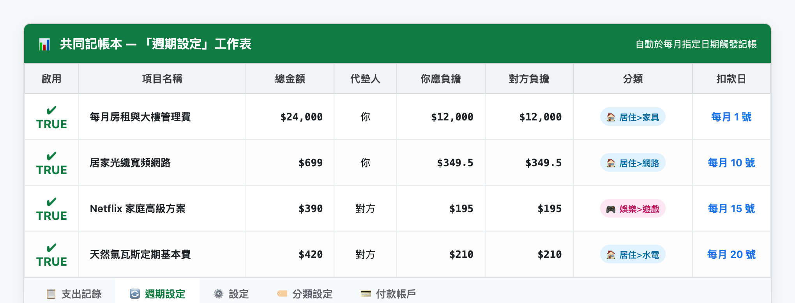
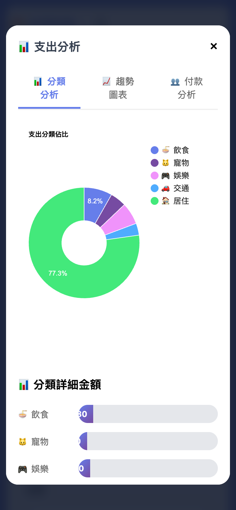

# 第 4 章：固定支出排程與月底報表分析

---
[← 上一章：03 出國旅遊與外幣帳本](./03_出國旅遊與外幣帳本.md) ｜ [下一章：05 舊帳遷移備份與維護 →](./05_舊帳遷移備份與維護.md)
---

共同生活中有許多每個月固定發生的開銷，例如房租、管理費、水電瓦斯、網路費或是 Netflix / Spotify 串流訂閱。如果每個月都要手動重新輸入一次，不僅容易遺忘，也增加許多繁瑣的負擔。

本章將介紹如何利用系統的「**自動週期排程**」與「**視覺化報表**」，讓每個月的財務管理變得優雅而省心。

---

## 1. 設定固定支出：每月自動定時入帳

只要在試算表中設定一次，系統便會在指定日期自動為您記上一筆，完全不需手動操作：

1. 開啟您的 Google 試算表，切換至 **`週期設定`** 工作表。
2. 每一列代表一個定期項目，填寫以下欄位：
   * **啟用**：勾選 `TRUE`（啟用此排程）。
   * **項目名稱**：例如 `每月房租`、`Netflix家庭方案`、`大樓管理費`。
   * **總金額**：例如 `22,000`。
   * **付款人**：由誰代墊支付（例如：`你`）。
   * **分攤金額**：例如你的責任額 `11,000`、對方責任額 `11,000`。
   * **分類**：選擇 `居住` 或 `娛樂`。
   * **扣款日期**：填寫每月的固定扣款日（例如每月 `1` 號或 `5` 號）。
3. **成果**：系統每天早上會自動比對日期，時間一到便會準時將該筆開銷寫入帳本並更新餘額。

---

## 2. 月底視覺化報表：錢究竟花到哪裡去了？

每到月底，您可以在手機介面的「統計報表」分頁中，即時瀏覽清晰美觀的財務圖表：

### 1. 本期分類佔比圓餅圖
一眼看懂當月份在「飲食」、「居住」、「交通」、「娛樂」等各項目的支出比例，快速找出哪一項生活開銷超出了預期。

### 2. 年度月度趨勢折線圖
追蹤整年度每個月的支出變化曲線，清楚掌握換季、過年或節慶月份的消費起伏，為家庭與個人的儲蓄規劃提供最扎實的數據參考。

---

## 3. 月底結算清帳：一鍵歸零，清爽明瞭

當雙方決定在月底或特定週期結清欠款時：

1. 在手機介面上點選 **「結算清帳」** 按鈕。
2. 系統會自動帶出目前該償還的金額與方向（例如：`對方支付 給 你 $3,500 元`）。
3. 現場轉帳完成後點擊「確認結算」。
4. 系統會自動產生一筆專屬的「結算記錄」，首頁的結餘卡片立刻**平順歸零**，開啟下一個記帳週期。

---

[← 上一章：03 出國旅遊與外幣帳本](./03_出國旅遊與外幣帳本.md) ｜ [下一章：05 舊帳遷移備份與維護 →](./05_舊帳遷移備份與維護.md)
