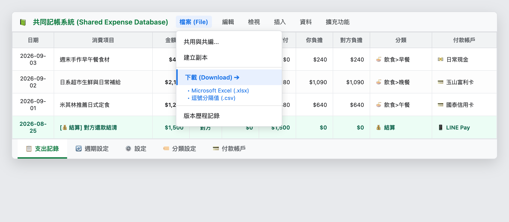

# 第 5 章：舊帳遷移、備份與日常維護

---
[← 上一章：04 固定支出排程與統計報表](./04_固定支出排程與統計報表.md) ｜ [下一章：附錄A 系統架構與設計原理 →](./附錄A_系統架構與設計原理.md)
---

轉換至新的記帳系統時，最令人擔心的往往是「過去記了幾年的舊帳該怎麼辦？」以及「資料是否能夠長久安全地保存？」。

本章將說明如何將過往在其他 App 中的帳目順暢遷移過來，以及日常備份與常見問題的排除方式。

---

## 1. 無痛遷移：匯入過往歷史舊帳

若您過去使用過 **SettleUp** 或 **AndroMoney** 等常見記帳工具，系統已具備智慧轉換能力：

### 匯入 SettleUp 舊帳
1. 從 SettleUp 匯出 CSV 交易記錄檔。
2. 將該 CSV 檔案上傳至您的 Google 雲端硬碟，在檔案上點右鍵選擇 **「以 Google 試算表開啟」**。
3. 將該試算表命名為 `SettleUp_transactions`，並與您的記帳本放在同一個資料夾。
4. 點選試算表頂部選單：`📊 記帳系統` → `📁 匯入歷史資料` → `SettleUp 匯入`。
5. 系統會自動解析多付款人金額、日期與分類，幾秒鐘內將所有歷史資料整齊匯入！

### 匯入 AndroMoney 或其他試算表
系統內建了標準的分類映射字典，能自動將舊有的細部子分類（如早餐、午餐、計程車、油錢）自動歸類至「飲食」、「交通」等核心分類中，讓歷史數據與新系統無縫接軌。

---

## 2. 數據的完全掌控：備份與匯出

使用本系統最大的安心感，來自於您對資料的 100% 掌控權：

* **隨時下載備份**：您可以在 Google 試算表左上角點選 `檔案` → `下載`，將整本帳冊以 **Excel (.xlsx)** 或 **CSV** 格式永久保存於個人電腦硬碟中。
* **雲端版本歷程**：Google 試算表自帶版本修訂紀錄，即使不小心手動改錯某一列，也能隨時一鍵還原到昨天的狀態。

---

## 3. 想自己改功能？自訂調整指南

許多讀者在使用一段時間後，會希望能針對自己的生活習慣進行個性化調整。以下為您區分「免寫程式即可修改」與「進階程式碼修改」的範圍：

### (1) 免寫程式！人人都能輕鬆自訂的項目（推薦）
只要直接打開您的 Google 試算表修改對應工作表，手機端就會即時同步：
* **修改消費分類**：在 `分類設定` 工作表中新增、刪除或修改分類名稱與 Emoji。
* **自訂首頁快捷按鈕**：在 `設定` 工作表第 10 列起，直接填入您最常買的品項名稱與預設金額。
* **增減固定排程扣款**：在 `週期設定` 工作表中新增房租、電信或訂閱服務。
* **管理付款方式**：在 `付款帳戶` 工作表中新增常用信用卡、悠遊卡或行動支付。

### (2) 進階程式碼修改須知（適合具備技術背景的讀者）
系統的前端介面（`index.html`）與後端計算邏輯（`Code.gs`）完全開放在 Apps Script 編輯器中：
* **介面外觀微調**：若想調整主題顏色或字體，可在 `index.html` 中的 `<style>` 區塊微調 CSS。
* **修改核心演算法**：若需大幅改動分帳公式或資料庫欄位，建議具備基本的 JavaScript 與 Google Apps Script 基礎。
* **安全防護提醒**：**在動手修改任何程式碼之前，請務必先在 Google 雲端硬碟建立一份試算表副本備份**。如此一來，若不小心改錯語法導致系統無法運行，隨時能有一份完整的備份可供還原。

---

## 4. 日常使用常見問題與排錯 (FAQ)

### Q1：手機開啟網頁時出現「🔒 無法存取」的提示？
* **原因**：目前開啟網頁的 Google 帳號尚未被加入白名單。
* **解決方式**：請試算表擁有者開啟試算表，切換到 `設定` 工作表，在儲存格 **`B6`** 填入您的 Google 信箱，儲存後重新整理網頁即可。

### Q2：如何新增或修改自訂的消費分類？
* **解決方式**：切換至試算表的 **`分類設定`** 工作表，直接在表格中新增或修改分類名稱與代表圖示，手機端會自動同步顯示。

### Q3：送出記帳時提示「分帳金額總和必須等於總金額」？
* **原因**：手動輸入分攤金額時，兩人的金額相加不等於上面的總花費。
* **解決方式**：檢查「你的部分」與「對方的部分」，確保兩者金額總和完全符合總金額即可。

---

[← 上一章：04 固定支出排程與統計報表](./04_固定支出排程與統計報表.md) ｜ [下一章：附錄A 系統架構與設計原理 →](./附錄A_系統架構與設計原理.md)
