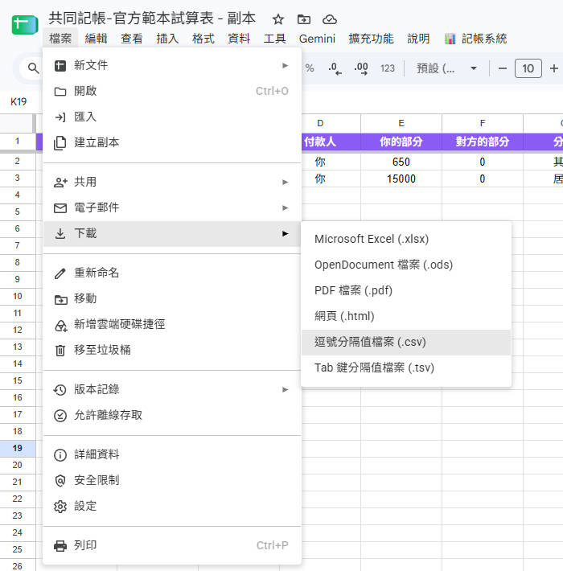

# 第 5 章：舊帳遷移與資料備份

轉換至新的記帳系統時，最令人擔心的往往是「過去記了幾年的舊帳該怎麼辦？」以及「資料是否能夠長久安全地保存？」。

本章將說明如何將過往在其他 App 中的帳目順暢遷移過來，以及日常備份與匯出的完全掌控權。

---

## 1. 無痛遷移：匯入過往歷史舊帳

若您過去使用過 **SettleUp** 或 **AndroMoney** 等常見記帳工具，系統已內建專屬的智慧轉換模組：

### 匯入 SettleUp 舊帳
1. 從 SettleUp 匯出 CSV 交易記錄檔。
2. 將該 CSV 檔案上傳至您的 Google 雲端硬碟，在檔案上點右鍵選擇 **「以 Google 試算表開啟」**。
3. 將該試算表命名為 `SettleUp_transactions`，並確保與您的主記帳本放在**同一個雲端資料夾**。
4. 點選試算表頂部選單：**`📊 記帳系統`** → **`⚙️ 進階設定`** → **`📥 匯入 SettleUp 資料`**。
5. 畫面上會跳出選單讓您點選「哪一個名字代表你」，確認後系統將自動將歷史資料整齊匯入！

### 匯入 AndroMoney 舊帳
1. 從 AndroMoney 匯出 CSV 檔案。
2. 上傳至 Google 雲端硬碟後點右鍵選擇 **「以 Google 試算表開啟」**。
3. 將該試算表命名為 `AndroMoney`，並放在與主記帳本**同一個雲端資料夾**。
4. 點選試算表頂部選單：**`📊 記帳系統`** → **`⚙️ 進階設定`** → **`📥 匯入 AndroMoney 資料`**。
5. 系統內建的分類映射與匯率折算模組，會自動將細部分類歸納並折算台幣後無縫匯入。

---

## 2. 數據的完全掌控：備份與匯出

使用本系統最大的安心感，來自於您對資料的 100% 掌控權：

* **隨時下載備份**：您可以在 Google 試算表左上角點選 `檔案` → `下載`，將整本帳冊以 **Excel (.xlsx)** 或 **CSV** 格式永久保存於個人電腦硬碟中。
* **雲端版本歷程**：Google 試算表自帶版本修訂紀錄，即使不小心手動改錯某一列，也能隨時一鍵還原到昨天的狀態。

